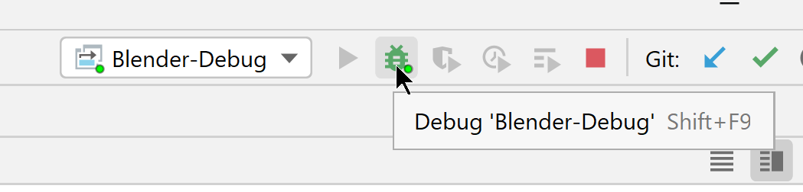
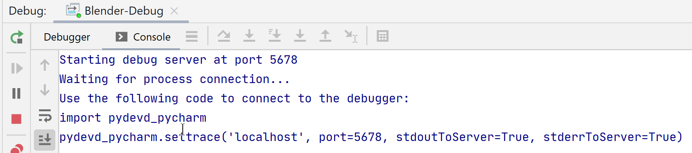
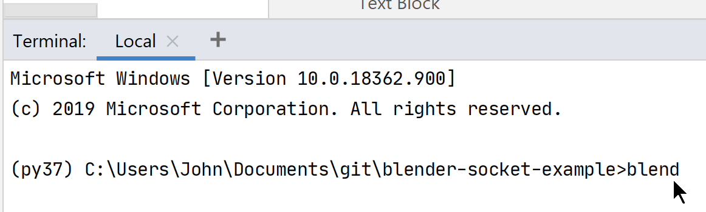
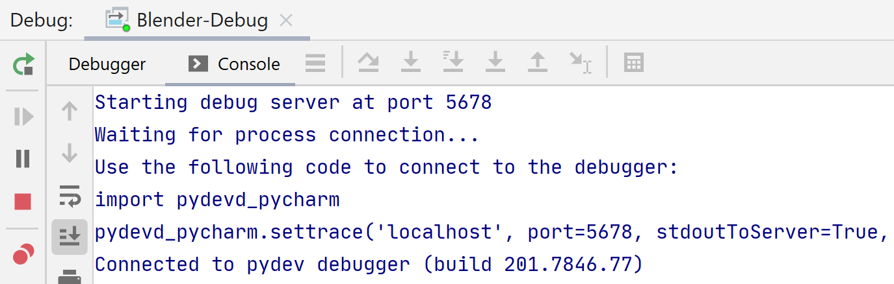
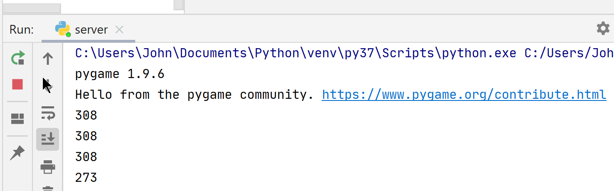
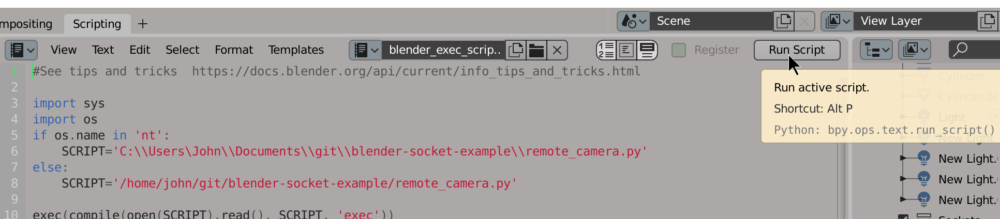
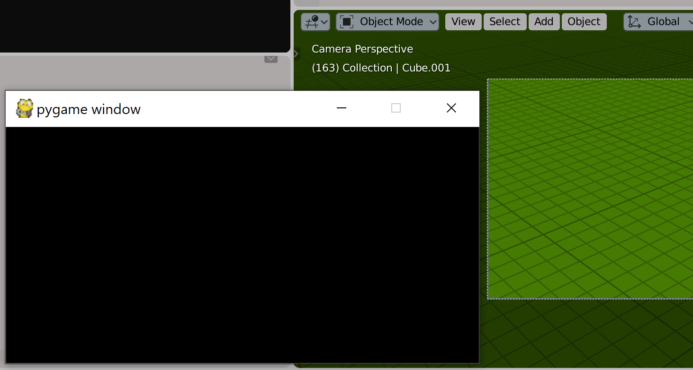

# blender-socket-example
Using a modal socket with blender to move &amp; control cameras or objects

In Pycharm start Debug Blender-Debug profile remote debugger

The debug console should show waiting for connection

Open up a local terminal in pycharm and run the blend batch or bash file

The Blender debug screen should now show connected

Run the server.py script. this runs a pygame console

Then in blender run the blender_exec_script

This should connect to the server.py socket
Arrow keys pressed in pygame terminal should move the camera view in blender

